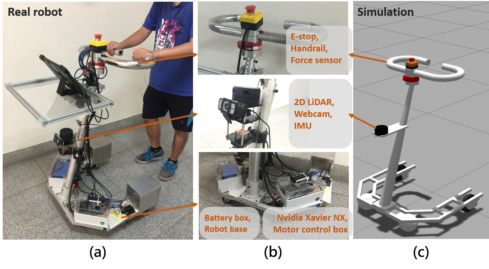

# socially-aware-walker
The repo is prepared for the active walker project for elders or people in mobility impaired.

If you are interested in this project, please check out our [wiki page](https://github.com/coolcat647/socially-aware-walker/wiki).

| Walking assist robot system | Simulation |
| -- | -------------------- |
|  |  |
| The walking assist robot is composed of the perception module, an embedded computer, and the motor controllers. | The walking assist robot is detecting and tracking the pedestrians in Gazebo. |
