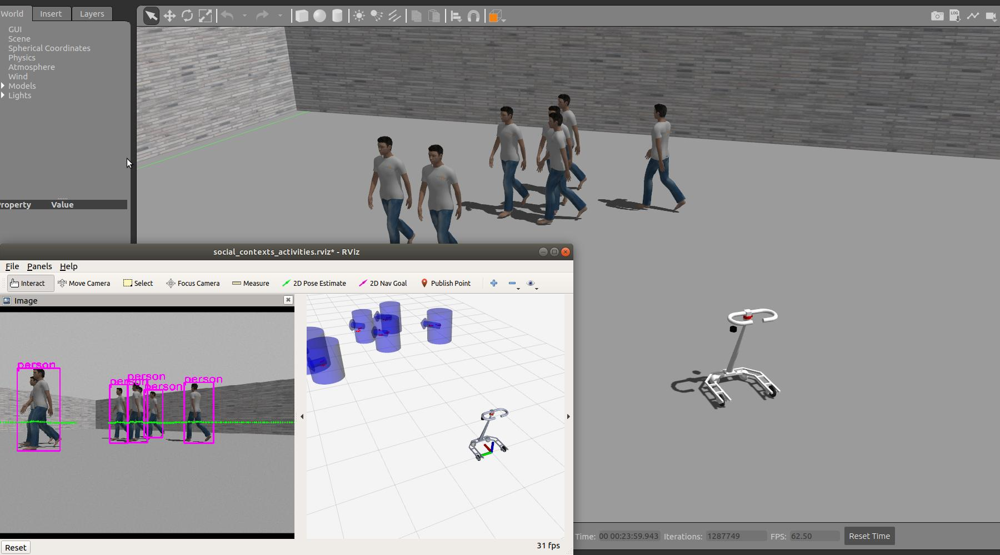

# active-walker
The repo is prepared for the active walker project for elders or people in mobility impaired.

## Simulation
The walking assist robot is conducting the pedestrians tracking with camera and laser scanner in Gazebo environment.


## I. Prerequisite
a. Dependencies (Please check out "Trouble shooting section" once you get installation problem.)
```bash
$ sudo apt-get install -y libavcodec-dev \
  gfortran \
  llvm-8 \
  libswscale-dev \
  libgeographic-dev \
  ros-melodic-geographic-msgs \
  ros-melodic-driver-base \
  ros-melodic-vision-opencv \
  ros-melodic-pcl-ros \
  ros-melodic-camera-info-manager \
  python-pip \
  python3-pip

$ pip2 install --user empy

$ pip3 install --user rospkg \
  empy \
  llvmlite==0.32.1 \
  numba==0.43.1 \
  scipy==1.4.1 \
  filterpy==1.4.5 \
  gdown
```


## II. Setup 
a. Build the packages with Python 3.6 compatible configuration
```bash
$ cd active-walker/catkin_ws
$ source compile_py36.sh
```
b. Sensor ports setup
```bash
$ cd active-walker    # In the project root directory
$ source set_port.sh
```
c. Download detection model
```bash
# In the "catkin_ws" directory
$ source devel/setup.sh
$ rosrun yolov4_pytorch download_weights.py   # Size of pre-trained model: ~282MB
```


## III. Docker (assume you have already installed nvidia-docker)
a. Build the docker image (takes about 15 mins)
```bash
# In the "Dockerfiles" directory, assume you have nvidia-driver (version >= 418)
$ source docker_build.sh
```
b. Launch  the docker container
```bash
# In the project root directory
$ source docker_run.sh cuda10
---- In the container ----
developer$ # Do something interesting
```
b. Get into the same docker container via another terminal 
```bash
# Another terminal, in the project root directory
$ source docker_run.sh same
```

___
## IV. Trouble shooting
a. Cannot find OpenCV library problem in JetPack 4 device --> create soft link near the "/usr/include/opencv4" 
```bash
$ sudo ln -s /usr/include/opencv4/ /usr/include/opencv
```
b. Cannot find LLVM-CONFIG  --> install llvm-8 and create soft link near the "/usr/bin/llvm-config-9" 
```bash
$ sudo apt-get install llvm-8
$ sudo ln -s /usr/bin/llvm-config-8 /usr/bin/llvm-config
```
c. TBB version is too old, 2019 update 5, i.e. TBB_INTERFACE_VERSION >= 11005 required
```bash
# Please check out: https://stackoverflow.com/a/56415940
```
d. Library mach has Fortran sources but no Fortran compiler found
```bash
$ sudo apt-get install gfortran
```


## Hardware list
a. Motor controller: [FAULHABER MCBL3006S](https://www.faulhaber.com/en/products/series/mcbl-3006-s)

b. Servomotor: [FAULHABER 4490H048B](https://www.faulhaber.com/fileadmin/Import/Media/EN_4490_B_FMM.pdf)

c. Force sensor: [WACOH WEF-6A200-4-RCD](https://wacoh-tech.com/en/products/dynpick/200n_rcd.html)

<!-- d. Laser range sensor: [HOKUYO URG-04LX-UG01](https://www.hokuyo-aut.jp/search/single.php?serial=166) -->
d. 2D LiDAR: [YDLIDAR G4](https://www.ydlidar.com/Public/upload/files/2020-04-13/YDLIDAR%20G4%20Datasheet.pdf)

e. IMU sensor: [SparkFun 9DoF Razor IMU M0 (SEN-14001)](https://www.sparkfun.com/products/retired/14001)
